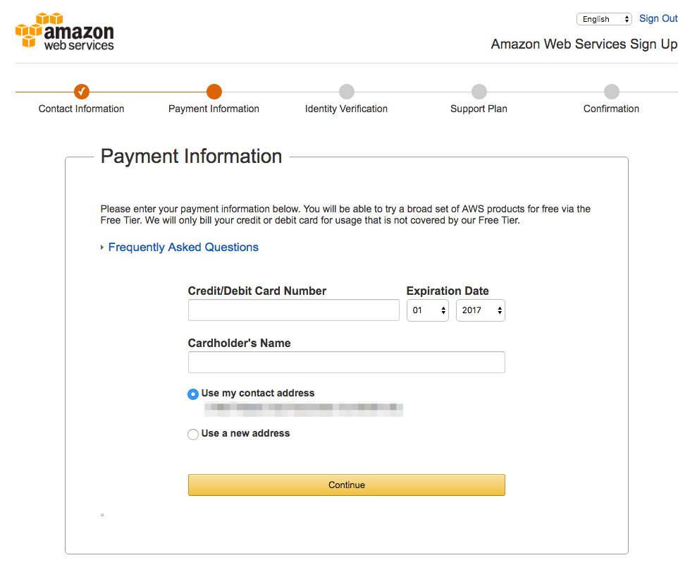
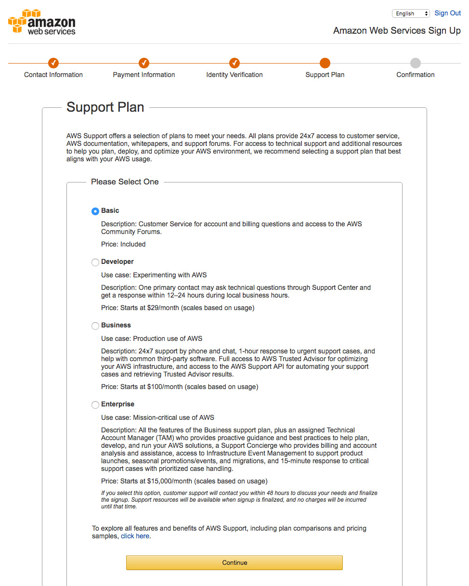
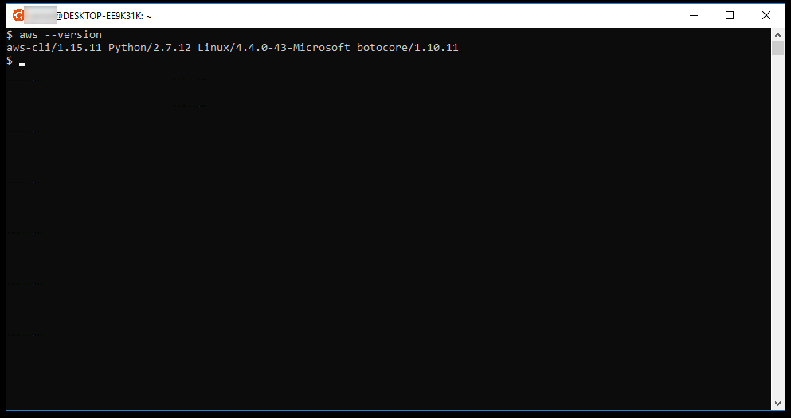
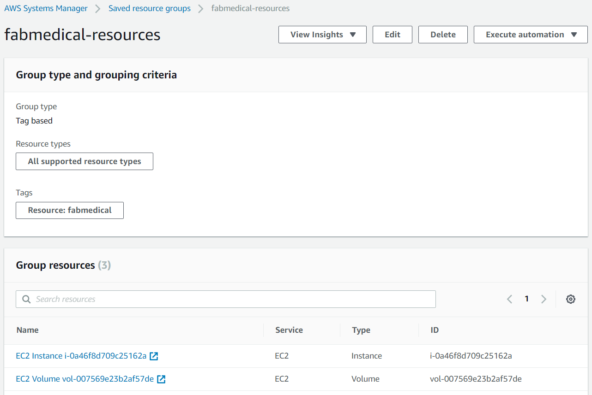
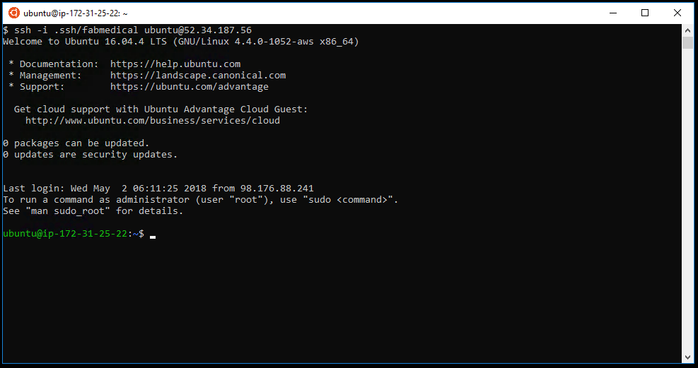
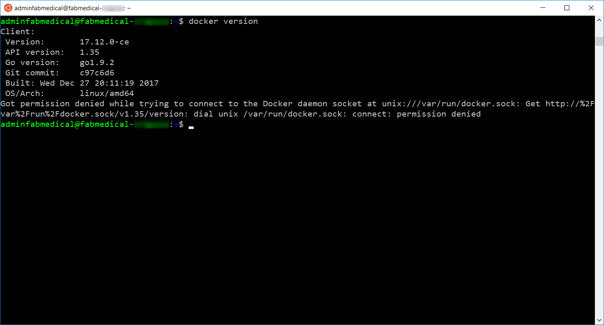
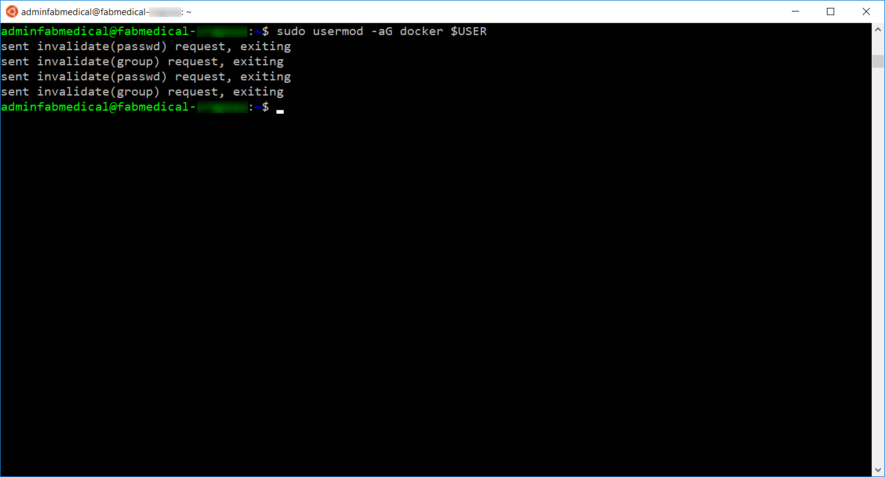
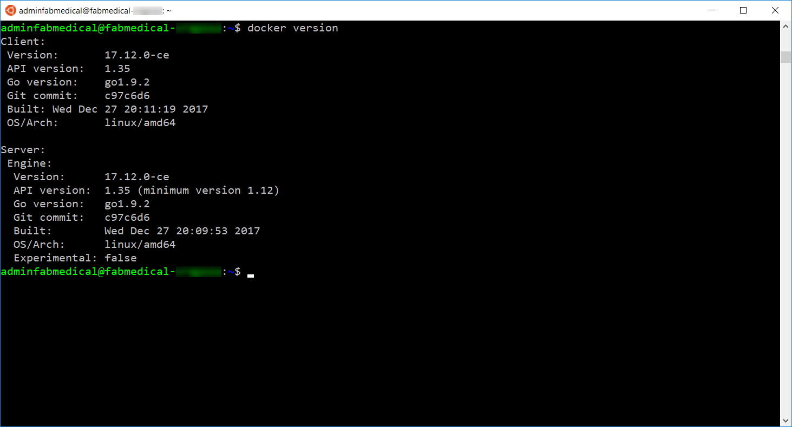

# AWS EKS Lab Setup

> LAST UPDATED: 1/23/2019

This document describes all of the preparation you should take care of prior to the workshop.
If you do not have time, you may work on this during the workshop but may not complete as many lab steps
during lab times and can work on your own time to complete the lab at your leisure.

## Prerequisites

The lab will make use of several tools and services.  Here is a list of requirements that you will need to successfully
complete the lab.  If you are missing any of these requirements, we will cover the steps to satisfy them in this document.

* An internet connection.
* An Amazon Web Services (AWS) Account.
  * You will need an email or mobile number.
  * You will need to enter credit card information.
* A DockerHub account
  * You will need an email address.
* A browser, preferably Chrome for consistency with this guide.
* A command prompt (some commands will work in windows CMD but for consistency we will use bash by default).
  * You will need openssh at a minimum.
  * You will need the aws cli.

## Preparation Steps in this Document

**Create your AWS Account**

* Task 1: Create an Amazon Web Services account
* Task 2: Install WSL (Bash on Ubuntu on Windows)
* Task 3: Install AWS CLI 
* Task 4: Setup IAM Access

##Create an EKS Cluster and supporting tooling / setup (30 minutes)**

* Task 1: Create an SSH key
* Task 2: Upload public key to EC2
* Task 3: Create a build agent VM
* Task 4: Create an AWS Resource Group
* Task 5: Add Resource tag to the Security Group
* Task 6: Connect securely to the build agent
* Task 7: Complete the build agent setup
* Task 8: Create a Docker Hub account
* Task 9: Create an Amazon EKS Cluster
* Task 10: Download the sample source

## Create an AWS Account

### Task 1: Create an Amazon Web Services account

**Duration:** 20-30 minutes

1. Go to the account signup page: [https://aws.amazon.com](https://aws.amazon.com)

    * If you are new to this site it will show a button in the header "Create AWS Account", click this.
    * If you have been here before it will how a button in the header "Sign In to the Console", click this.

    To create your account (assuming you don't have one):

    * Enter email or mobile number.
    * Choose “I am a new user.”
    * Click “Sign in using our secure server”

    

2. Enter your name, and retype your email address. Choose a password.

    

3. Choose personal or company account. Then Fill out the required information. Click “Create Account and Continue”. **Tip: Do not include any whitespace when entering the CAPTCHA characters.**

    

4. Next enter payment information.

    

5. Next provide a telephone number so that Amazon can verify your identity.

    

    * When the call arrives, enter the pin as displayed

        

    * Now click “Continue”

        

6. Choose the basic support plan.

    

7. You should be returned to the AWS home page. Click “Sign In to the Console”

    

8. Now choose that you are a returning user and enter your password. Click the sign-in button.

    

9. You should be logged in to the console.

    

### Task 2: Install WSL (Bash on Ubuntu on Windows)

> NOTE: If you are using a Windows 10 development machine, follow these steps. For Mac OS you can ignore this step since you will be using Terminal for all commands.

You will need WSL to complete various steps. A complete list of instructions for supported Windows 10 versions is available on this page: [https://docs.microsoft.com/en-us/windows/wsl/install-win10](https://docs.microsoft.com/en-us/windows/wsl/install-win10)

### Task 3: Install AWS CLI

**Duration:** 5-10 minutes

**Instructions**
[http://docs.aws.amazon.com/cli/latest/userguide/installing.html#install-bundle-other-os](http://docs.aws.amazon.com/cli/latest/userguide/installing.html#install-bundle-other-os)

1. Check python install

    `$ python --version`

    > This should print out version info, otherwise you must install python.
    
    > WSL users: try `sudo apt update && sudo apt install python-minimal` if python is not found.

2. Download the installer:

    `$ curl "https://s3.amazonaws.com/aws-cli/awscli-bundle.zip" -o "awscli-bundle.zip"`

3. Unpack the bundle:

    `$ unzip awscli-bundle.zip`
    
    > WSL users: try `sudo apt install unzip` if this command fails

4. Run the installer:

    `$ sudo ./awscli-bundle/install -i /usr/local/aws -b /usr/local/bin/aws`

5. Test your installation:

    `$ aws --version`

    > This should print version information.

    

### Task 4: Setup IAM Access

**Duration:** 20-25 minutes

We will create an account admin for the purposes of running the examples in this workshop.
The account admin can be deleted after the workshop if you choose.

1. Login to the AWS console: [https://console.aws.amazon.com](https://console.aws.amazon.com)

2. Type IAM in the search box:

    

3. Click the search result to go to Identity and Access Management. Then click on “Users”

    

4. Click “Add user”

    

5. Enter “workshop-admin” as the user name. Choose “Programmatic access” as the access type. Click next.

    

6. Choose “Attach existing policies directly”, then search for the policy named “AdministratorAccess” check the checkbox next to the policy. Click next.

    

7. Review the configuration, then click “Create User”

    

    > **Important:** Amazon will only display the secret access key once--on this screen. Do not click close until you have captured the key.

    Click “Download .csv” and a file will download which contains the key.

    

    Alternatively, click “Show” and the key will be shown inline.

    

8. Now use the keys to configure the AWS cli.

    * Open your terminal/command prompt and run “aws configure”

        `$ aws configure`

        * Enter the Access Key ID when prompted.
        * Enter the Secret Access Key when prompted.
        * Use enter to accept the remaining defaults.

9. Test the configuration by describing ec2 instances.

    `$ aws ec2 describe-instances --region us-west-2`

10. There shouldn’t be any yet, but the command should succeed

    

## Before the Workshop

**Duration**: 30 minutes (possibly additional time if AWS provisioning is slower)

### Task 1: Create an SSH key

In this section, you will create an SSH key to securely access the VMs you create during the upcoming exercises.

1. Open a WSL command window.

    

    or

    

2. From the command line, enter the following command to ensure that a directory for the SSH keys is created. You can ignore any errors you see in the output.

    `mkdir .ssh`

3. From the command line, enter the following command to generate an SSH key pair. You can replace “admin” with your preferred name or handle.

    `ssh-keygen -t RSA -b 2048 -C admin@fabmedical`

4. You will be asked to save the generated key to a file. Enter ".ssh/fabmedical" for the name.
5. Enter a passphrase when prompted, and don’t forget it!
6. Because you entered “.ssh/fabmedical”, the file will be generated in the “.ssh” folder in your user folder, where WSL opens by default.
7. Keep this WSL window open and remain in the default directory you will use it in later tasks.

    

### Task 2: Upload public key to EC2

In this section, you will upload the public portion of the key pair you just created to EC2. This allows AWS to assign the key to resources as it creates them, which in turn allows you to authenticate with those resources using the private key.

1.  In your WSL terminal, run the following command to upload your public key material.

    > Note that this command will upload the key to `us-west-2`, if you would like to use a different region, be sure to update the command to reflect your preference.
    
    ```bash
    aws ec2 import-key-pair --key-name fabmedical_rsa --public-key-material "`cat .ssh/fabmedical.pub`" --region us-west-2
    ```

1. From the AWS Console type “EC2” in the services search box. Select the “EC2” search result.

    

1. On the EC2 Dashboard, click the “Key Pairs” item on the left menu.

    

1. Your key should now be available.

    

### Task 3: Create a build agent VM

In this section, you will create a Linux VM to act as your build agent. You will be installing Docker to this VM once it is set up and you will use this VM during the lab to develop and deploy.

> NOTE: You can set up your local machine with Docker however the setup varies for different versions of Windows. **For this** lab, the build agent approach simply allows for predictable setup.

1. Navigate to the EC2 Dashboard. On the EC2 Dashboard, click “Launch Instance”

    

2. Check the checkbox for “Free tier only” then choose “Ubuntu Server 16.04 LTS”. Make sure you are using the x86 based processor version.

    

3. Accept the default choice for instance type: t2.micro. Click Next.

    

4. Accept all the default parameters for “Step 3” and click Next.
5. Accept all the default parameters for “Step 4” and click Next.
6. Add a name tag with the value “build-agent”. Add another tag. Use “Resource” as the key and “fabmedical” as the value. Click Next.

    

7. In Step 6 we will create a security group, but we need to give it a proper name. Enter “fabmedical-build-agent” as the security group name and enter “Allow SSH access” as the description. Click “Review and Launch”.

    

8. Click launch to launch the VM. The final piece of configuration will be choosing the key pair you would like to use to access the VM. Choose “fabmedical\_rsa” the key you imported previously. You will not be able to click “Launch Instances” until you acknowledge that you have access to the private key.

    

9. The VM will begin deployment into your default VPC.

    

10. When the VM is provisioned you will see it in your list of instances.

    

### Task 4: Create an AWS Resource Group

1. Login to console.
2. Choose "Resource Groups" from the top menu bar.

   

3. Choose "Create a Resource Group"

   

4. Configure as described below, then click "Save".
    * Use "fabmedical-resources" as the group name.
    * For Tags, type "Resource" as the key and "fabmedical" as the value.

     

5. The Resource Group is created

   

### Task 5: Add Resource tag to the Security Group

In this section, you will add a Resource tag to the fabmedical-build-agent security group. Because we created the security group using the launch wizard, we were not able to set tags. This can make it easy to forget to clean up the security group, because it will not show up in a resource group search.

1. Navigate to EC2 and click on “Security Groups”

    

2. Select the security group with the group name “fabmedical-build-agent”

    

3. Click “Tags” in the bottom half of the screen. Then click “Add/Edit
    Tags”

    

4. Click “Create Tag”, then enter “Resource” as the key, and “fabmedical” as the value. Then click “Save”.

    

5. The resource tag appears in the list of the security group’s tag.

    

### Task 6: Connect securely to the build agent

In this section, you will validate that you can connect to the new build agent VM.

1. From the AWS Console, navigate to the Resource Group you created previously and select the new VM, build-agent. Click the “Go” link.

    

2. In the bottom portion of the EC2 instance list, take note of the public IP address for the VM.

    

3. From your WSL terminal, connect to the new VM you created by typing the following command.

    `ssh -i .ssh/[PRIVATEKEYNAME] [BUILDAGENTUSERNAME]@[BUILDAGENTIP]`

    Use the private key name such as “fabmedical\_rsa”, the username for the VM such as “ubuntu”, and the IP address for the build agent VM.

    `ssh -i .ssh/fabmedical ubuntu@52.34.187.56`

5. You will be asked to confirm if you want to connect, as the authenticity of the connection cannot be validated. Type “yes”.

6. You will be asked for the pass phrase for the private key you created previously. Enter this value.

7. You will now be connected to the VM with a command prompt such as the following. Keep this command prompt open for the next step.

    `ubuntu@ip-172-31-16-103:~$`

    

    > **NOTE: If you have issues connecting, you may have pasted the imported the SSH public key** **into EC2** **incorrectly.** **Unfortunately, if this is the case, you** **must** **retry the import, then try to create the VM again.**

### Task 7: Complete the build agent setup

In this task, you will update the packages and install Docker engine.

1. Go to the WSL window that has the SSH connection open to the build agent VM.
2. Update the Ubuntu packages and install curl and support for repositories over HTTPS in a single step by typing the following in a single line command. When asked if you would like to proceed, respond by typing “y” and pressing enter.

    `sudo apt-get update && sudo apt install apt-transport-https ca-certificates curl software-properties-common`

3. Add Docker’s official GPG key by typing the following in a single line command.

    `curl -fsSL https://download.docker.com/linux/ubuntu/gpg | sudo apt-key add -`

4. Add Docker’s stable repository to Ubuntu packages list by typing the following in a single line command.

    `sudo add-apt-repository "deb [arch=amd64] https://download.docker.com/linux/ubuntu $(lsb_release -cs) stable"`

5. Update the Ubuntu packages and install Docker engine, node.js and the node package manager in a single step by typing the following in a single line command. When asked if you would like to proceed, respond by typing “y” and pressing enter.

    `sudo apt-get update && sudo apt install docker-ce nodejs npm`

6. Now, upgrade the Ubuntu packages to the latest version by typing the following in a single line command. When asked if you would like to proceed, respond by typing “y” and pressing enter.

    `sudo apt-get upgrade`

7. When the command has completed, check the Docker version installed by executing this command. The output may look something like that shown in the following screen shot. Note that the server version is not shown yet, because you didn’t run the command with elevated privileges (to be addressed shortly).

    `docker version`
    

8. You may check the versions of node.js and npm as well, just for information purposes, using these commands.

    `nodejs --version`

    `npm -version`

9. Add your user to the Docker group so that you do not have to elevate privileges with sudo for every command. You can ignore any errors you see in the output.

    `sudo usermod -aG docker $USER`
    

10. In order for the user permission changes to take effect, exit the SSH session by typing ‘exit’, then press \<Enter>. Repeat the commands in Task 7: Connect securely to the build agent from step 4 to establish the SSH session again.
11. Run the Docker version command again, and note the output now shows the server version as well.

    

12. Run a few Docker commands.

    * One to see if there are any containers presently running

        `docker container ls`

    * One to see if any containers exist whether running or not

        `docker container ls -a`

13. In both cases, you will have an empty list but no errors running the command. Your build agent is ready with Docker engine running properly.

    

### Task 8: Create a Docker Hub account

Docker images are deployed from a Docker Registry.
To complete the lab, you will need access to a registry that is publicly accessible to the AWS Cloud cluster you are creating.
In this task, you will create a free Docker Hub account for this purpose, where you push images for deployment.

> NOTE: If you already have a public Docker Hub account you do not need to complete this task – you will need the name of the account for the exercises that rely on it.

1. Navigate to Docker Hub at [https://hub.docker.com](https://hub.docker.com).
2. Create a new Docker Hub account by providing a unique name for your Docker Hub ID, your email address for confirmation of the account, and a password.

    

3. Once you confirm your email address, you can sign in and confirm your Docker Hub account is ready.

    

4. Login to your Docker Hub account. If it is a new account, you will not see any repositories yet. You will create these during the lab.

    

### Task 9: Create an Amazon EKS Cluster

#### Create your Amazon EKS Service Role

##### To create your Amazon EKS service role in the IAM console

  1. Open the IAM console at https://console.aws.amazon.com/iam/.
  2. Choose `Roles`, then `Create role`.
  3. Choose `EKS` from the list of services, then `Allows Amazon EKS to manage your clusters on your behalf` for your use case, then `Next: Permissions`.
  4. Accept the defaults and choose `Next: Tags`.
  5. Add a `Resource` tag with the value `fabmedical`.
  6. Choose `Next: Review`.
  7. For `Role name`, enter a unique name for your role, such as *fabmedical-eksServiceRole*, then choose `Create role`.

#### Create your Amazon EKS Cluster VPC

##### To create your cluster VPC

  1. Open the AWS CloudFormation console at https://console.aws.amazon.com/cloudformation.
  2. From the navigation bar, select a Region that supports Amazon EKS.

      `Note`
        
        Amazon EKS is available in the following Regions at this time:

        - `US West (Oregon)` (us-west-2)
        - `US East (N. Virginia)` (us-east-1)
        - `US East (Ohio)` (us-east-2)
        - `EU (Frankfurt)` (eu-central-1)
        - `EU (Stockholm)` (eu-north-1)
        - `EU (Ireland)` (eu-west-1)
        - `Asia Pacific (Tokyo)` (ap-northeast-1)
        - `Asia Pacific (Seoul)` (ap-northeast-2)
        - `Asia Pacific (Singapore)` (ap-southeast-1)
        - `Asia Pacific (Sydney)` (ap-southeast-2)
  3. Choose `Create stack`.
  4. For `Choose a template`, select `Specify an Amazon S3 template URL`.
  5. Past the following URL into the text area and choose `Next`:
            
            https://amazon-eks.s3-us-west-2.amazonaws.com/cloudformation/2019-01-09/amazon-eks-vpc-sample.yaml
  6. On the `Specify Details` page, fill out the parameters accordingly, and then choose `Next`.
      - `Stack name`: Choose a stack name for your AWS CloudFormation stack.  For example, you can call it `fabmedical-eks-vpc`.
      - `VpcBlock`: Choose a CIDR range for your VPC. You may leave the default value.
      - `Subnet01Block`: Choose a CIDR range for subnet 1. You may leave the default value.
      - `Subnet02Block`: Choose a CIDR range for subnet 2. You may leave the default value.
      - `Subnet03Block`: Choose a CIDR range for subnet 3. You may leave the default value.
  7. (Optional) On the `Options` page, tag your stack resource by creating a `Resource` tag with the value `fabmedical`. Choose `Next`.
  8. On the `Review` page, choose `Create`.
  9. When your stack is created, select it in the console and choose `Outputs`.
  10. Record the `SecurityGroups` value for the security group that was created. You need this when you create your EKS cluster; this security group is applied to the cross-account elastic network interfaces that are created in your subnets that allow the Amazon EKS control plane to communicate with your worker nodes.
  11. Record the `VpcId` for the VPC that was created. You need this when you launch your worker node group template.
  12. Record the `SubnetIds` for the subnets that were created. You need this when you create your EKS cluster; these are the subnets the your worker nodes are launched into.

##### Install and Configure kubectl for Amazon EKS

Kubernetes uses a command-line utility called `kubectl` for communicating with the cluster API server. Amazon EKS clusters also require the [AWS IAM Authenticator for Kubernetes](https://github.com/kubernetes-sigs/aws-iam-authenticator) to allow IAM authentication for your Kubernetes cluster. Beginning with Kubernetes version 1.10, you can configure the `kubectl` client to work with Amazon EKS by installing the AWS IAM Authenticator for Kubernetes and modifying your `kubectl` configuration file to use it for authentication.

Amazon EKS vends `aws-iam-authenticator` binaries that you can use that are identical to the upstream `aws-iam-authenticator` binaries with the same version. Alternatively, you can use `go get` to fetch the binary from the [AWS IAM Authenticator for Kubernetes](https://github.com/kubernetes-sigs/aws-iam-authenticator) project on GitHub.

##### To install `kubectl` for Amazon EKS

You have multiple options to download and install `kubectl` for your operating system.
  - The `kubectl` binary is available in many operating system package managers, and this options is often much easier than a manual download and install process.  You can follow the instructions for your specific operating system or package manager in the [Kubernetes documentation](https://kubernetes.io/docs/tasks/tools/install-kubectl/) to install.
  - Amazon EKS also vends `kubectl` binaries that you can use that are identical to the upstream `kubectl` binaries with the same version. To install the Amazon EKS-vended binary for your operating system, see [Installing kubectl](https://docs.aws.amazon.com/eks/latest/userguide/install-kubectl.html).

###### To install `kubectl` on Linux

1. Download the Amazon EKS-vended `kubectl` binary from Amazon S3:

        curl -o kubectl https://amazon-eks.s3-us-west-2.amazonaws.com/1.11.5/2018-12-06/bin/linux/amd64/kubectl

2. (Optional) Verify the downloaded binary with the SHA-256 sum for your binary.

    a. Download the SHA-256 sum for Linux:

        curl -o kubectl.sha256 https://amazon-eks.s3-us-west-2.amazonaws.com/1.11.5/2018-12-06/bin/linux/amd64/kubectl.sha256

    b. Check the SHA-256 sum for your downloaded binary.

        openssl dgst -sha256 kubectl

    c. Compare the generated SHA-256 sum in the command output against your downloaded SHA-256 file. The two should match.

3. Apply execute permissions to the binary.

        chmod +x ./kubectl

4. Copy the binary to a folder in your `PATH`. If you have already installed a version of `kubectl`, then we recommmend creating a `$HOME/bin/kubectl` and ensuring that `$HOME/bin` comes first in your `$PATH`.

        mkdir -p $HOME/bin && mv ./kubectl $HOME/bin/kubectl && export PATH=$HOME/bin:$PATH

##### To install `aws-iam-authenticator` for Amazon EKS

  1. Download and install the `aws-iam-authenticator` binary.

Amazon EKS vends `aws-iam-authenticator` binaries that you can use, or you can use `go get` to fetch the binary from the [AWS IAM Authenticator for Kubernetes](https://github.com/kubernetes-sigs/aws-iam-authenticator) project on GitHub for other operating systems.

  - To download and install the Amazon EKS-vended `aws-iam-authenticator` binary:

    a. Download the Amazon EKS-vended `aws-iam-authenticator` binary from Amazon S3:

      - Linux: https://amazon-eks.s3-us-west-2.amazonaws.com/1.11.5/2018-12-06/bin/linux/amd64/aws-iam-authenticator
      - MacOS: https://amazon-eks.s3-us-west-2.amazonaws.com/1.11.5/2018-12-06/bin/darwin/amd64/aws-iam-authenticator
      - Windows: https://amazon-eks.s3-us-west-2.amazonaws.com/1.11.5/2018-12-06/bin/windows/amd64/aws-iam-authenticator.exe

      `Note`

      To use `kubectl` in the Ubuntu build agent shell, you will need to install the linux binaries in said shell.

      Use the command below to download the binary, substituting the correct URL for your platform.  The example below is for Linux clients.
      
        curl -o aws-iam-authenticator https://amazon-eks.s3-us-west-2.amazonaws.com/1.11.5/2018-12-06/bin/linux/amd64/aws-iam-authenticator
    b. (Optional) Verify the downloaded binary with the SHA-256 sum provided in the same bucket prefix, substituting the correct URL for your platform.  

    - Download the SHA-256 sum for your system. The example below is to download the SHA-256 sum for Linux clients.

          curl -o aws-iam-authenticator.sha256 https://amazon-eks.s3-us-west-2.amazonaws.com/1.11.5/2018-12-06/bin/linux/amd64/aws-iam-authenticator.sha256
    - Check the SHA-256 sum for your downloaded binary. The example `openssl` command below was testd for macOS and Ubuntu clients. Your operating system may use a different command or syntax to check SHA-256 sums. Consult your operating system documentation if necessary.

          ubuntu@ip-172-31-60-76:~$ openssl dgst -sha256 aws-iam-authenticator
          SHA256(aws-iam-authenticator)= a46c66eb14ad08204f2f588b32dc50b10e9a8a0cc48ddf0966596d3c07abe059
          ubuntu@ip-172-31-60-76:~$ cat aws-iam-authenticator.sha256
          a46c66eb14ad08204f2f588b32dc50b10e9a8a0cc48ddf0966596d3c07abe059 aws-iam-authenticator

    - Compare the generated SHA-256 sum in the command output against your downloaded `aws-iam-authenticator.sha256` file. The two should match.

    c. Apply execute permissions to the binary (for macOS and linux clients).

          chmod +x ./aws-iam-authenticator
    d. Copy the binary to a folder in your $PATH. We recommend creating a `$HOME/bin/aws-iam-authenticator` and ensuring that `$HOME/bin` comes first in your $PATH.

          mkdir -p $HOME/bin && mv ./aws-iam-authenticator $HOME/bin/aws-iam-authenticator && export PATH=$HOME/bin:$PATH
    e. Add `$HOME/bin` to your `PATH` environment variable.

    - For Bash shells on macOS:

            echo 'export PATH=$HOME/bin:$PATH' >> ~/.bash_profile
    - For Bash shells on Linux:

            echo 'export PATH=$HOME/bin:$PATH' >> ~/.bashrc
    f. Test that the `aws-iam-authenticator` binary works.

          aws-iam-authenticator help

  - Or, to install the `aws-iam-authenticator` binary from GitHub using `go get`:

    a. Install the Go programming language for your operating system if you do not already have `go` installed. For more information, see [Install the Go tools](https://golang.org/doc/install#install) in the Go documentation.
    b. Use `go get` to install the `aws-iam-authenticator` binary.

        go get -u -v github.com/kubernetes-sigs/aws-iam-authenticator/cmd/aws-iam-authenticator
    c. Add `$HOME/go/bin` to your PATH environment variable.
    d. Test that the `aws-iam-authenticator` binary works.

        aws-iam-authenticator help
  
  2. If you have an existing Amazon EKS cluster, create a `kubeconfig` file for that cluster. For more information, see [Create a kubeconfig for Amazon EKS](https://docs.aws.amazon.com/eks/latest/userguide/create-kubeconfig.html). Otherwise, see [Creating an Amazon EKS Cluster](https://docs.aws.amazon.com/eks/latest/userguide/create-cluster.html) to createa new Amazon EKS cluster.

###### Install the latest AWS CLI

To install the latest AWS CLI (which is necessary to access EKS related calls), execute the following in the build agent SSH shell:

        sudo apt install python
        curl -O https://bootstrap.pypa.io/get-pip.py
        python get-pip.py --user
        echo 'export PATH=~/.local/bin:$PATH' >> ./.bashrc
        source ~/.bashrc
        pip --version
        pip install awscli --upgrade --user
        aws --version

And then use `aws configure` to set your `AWS Access Key ID` and `AWS Secret Access Key` that you obtained when creating your IAM user in a previous step.

##### Create Your Amazon EKS Cluster

Now you can create your Amazon EKS cluster.

###### Important

  When an Amazon EKS cluster is created, the IAM entity (user or role) that creates the cluster is added to the Kubernetes RBAC authorization table as the administrator (with `system:master` permissions). Initially, only that IAM user can make calls to the Kubernetes API server using `kubectl`. For more information, see [Managing Users or IAM Roles for your Cluster](https://docs.aws.amazon.com/eks/latest/userguide/add-user-role.html). Also, the [AWS IAM Authenticator for Kubernetes](https://github.com/kubernetes-sigs/aws-iam-authenticator) uses the AWS SDK for Go to authenticate against your Amazon EKS cluster. If you use the console to create the cluster, you must ensure that the same IAM user credentials are in the AWS SDK credential chain when you are running `kubectl` commands on your cluster.

  If you install and configure the AWS CLI, you can configure the IAM credentials for your user. These also work for the [AWS IAM Authenticator for Kubernetes](https://github.com/kubernetes-sigs/aws-iam-authenticator). If the AWS CLI is configured properly for your user, then the [AWS IAM Authenticator for Kubernetes](https://github.com/kubernetes-sigs/aws-iam-authenticator) can find those credentials as well.  For more information, see [Configuring the AWS CLI](https://docs.aws.amazon.com/cli/latest/userguide/cli-chap-getting-started.html) in the *AWS Command Line Interface User Guide*.

###### To create your cluster with the console

  1. Open the Amazon EKS console at https://console.aws.amazon.com/eks/home#/clusters.
  2. Choose `Create Cluster`.

  `Note`

    If your IAM user does not have administrative privileges, you must explicitly add permissions for that user to call the Amazon EKS API operations. For more information, see [Creating Amazon EKS IAM Policies](https://docs.aws.amazon.com/eks/latest/userguide/EKS_IAM_user_policies.html).

  3. On the `Create cluster` page, fill in the following fields and then choose `Create`:

  * `Cluster name`: A unique name for your cluster. You can use something similar to `fabmedical-eks-cluster`.
  * `Kubernetes version`: The version of Kubernetes to use for your cluster. By default, the latest avaialable version is selected.
  * `Role ARN`: Select the IAM role that you created with [Create your Amazon EKS Service Role](https://docs.aws.amazon.com/eks/latest/userguide/getting-started.html#role-create).
  * `VPC`: The VPC you created with [Create your Amazon EKS Cluster VPC](https://docs.aws.amazon.com/eks/latest/userguide/getting-started.html#vpc-create). You can find the name of your VPC in the drop-down list.
  * `Subnets`: The `SubnetIds` values (comma-separated) from the AWS CloudFormation output that you generated with [Create your Amazon EKS Cluster VPC](https://docs.aws.amazon.com/eks/latest/userguide/getting-started.html#vpc-create). By default, the available subnets in the above VPC are preselected.
  * `Security Groups`: The `SecurityGroups` value from the AWS CloudFormation output that you generated with [Create your Amazon EKS Cluster VPC](https://docs.aws.amazon.com/eks/latest/userguide/getting-started.html#vpc-create). This security group has `ControlPlaneSecurityGroup` in the drop-down name.

  `Important`

    The worker node AWS CloudFormation template modifies the security group that you specify here, so we recommend that you use a dedicated security group for your cluster control plane. If you share it with other resources, you may block or disrupt connections to those resources.

  `Note`

    You may receive an error that one of the Availability Zones in your request does not have sufficient capacity to create an Amazon EKS cluster. If this happens, the error output contains the Availability Zones that can support a new cluster. Retry creating your cluster with at least two subnets that are located in the supported Availability Zones for your account.

  4. On the `Clusters` page, choose the name of your newly created cluster to view the cluster information.
  5. The `Status` field shows `CREATING` until the cluster provisioning process completes.

###### To create your cluster with the AWS CLI

  1. Create your cluster with the following command. Substitute your cluster name, the Amazon Resource Name (ARN) of your Amazon EKS service role that your created in [Create your Amazon EKS Service Role](https://docs.aws.amazon.com/eks/latest/userguide/getting-started.html#role-create), and the subnet and security group IDs for the VPC that you created in [Create your Amazon EKS Cluster VPC](https://docs.aws.amazon.com/eks/latest/userguide/getting-started.html#vpc-create).

    aws eks create-cluster --name devel --role-arn arn:aws:iam::111122223333:role/eks-service-role-AWSServiceRoleForAmazonEKS-EXAMPLEBKZRQR --resources-vpc-config subnetIds=subnet-a9189fe2,subnet-50432629,securityGroupIds=sg-f5c54184

  `Important`

  If you receive a syntax error similar to the following, you may be using a preview version of the AWS CLI for Amazon EKS. The syntax for many Amazon EKS commands has changed since the public service launch. Please update your AWS CLI version to the latest available and be sure to delete the custom service model directory at `~/.aws/models/eks`.

      aws: error: argument --cluster-name is required

  `Note`

  If your IAM user does not have administrative privileges, you must explicitly add permissions for that user to call the Amazon EKS API operations. For more information, see [Creating Amazon EKS IAM Policies](https://docs.aws.amazon.com/eks/latest/userguide/EKS_IAM_user_policies.html).

  Output:

    {
        "cluster": {
            "name": "devel",
            "arn": "arn:aws:eks:us-west-2:111122223333:cluster/devel",
            "createdAt": 1527785885.159,
            "version": "1.10",
            "roleArn": "arn:aws:iam::111122223333:role/eks-service-role-AWSServiceRoleForAmazonEKS-AFNL4H8HB71F",
            "resourcesVpcConfig": {
                "subnetIds": [
                    "subnet-a9189fe2",
                    "subnet-50432629"
                ],
                "securityGroupIds": [
                    "sg-f5c54184"
                ],
                "vpcId": "vpc-a54041dc"
            },
            "status": "CREATING",
            "certificateAuthority": {}
        }
    }

  2. Cluster provisioning usually takes less than 10 minutes. You can query the status of your cluster with the following command. When your cluster status is ACTIVE, you can proceed.

    aws eks describe-cluster --name fabmedical-eks-cluster --query cluster.status

##### Configure `kubectl` for Amazon EKS

In this section, you create a `kubeconfig` file for your cluster with the AWS CLI `update-kubeconfig` command. If you do not want to install the AWS CLI, or if you would prefer to create or update your `kubeconfig` manually, see [Create a kubeconfig for Amazon EKS](https://docs.aws.amazon.com/eks/latest/userguide/create-kubeconfig.html).

###### To create your `kubeconfig` file with the AWS CLI

  1. Ensure that you have at least version 1.16.73 of the AWS CLI installed. To install or upgrade the AWS CLI, see [Installing the AWS Command Line Interface](https://docs.aws.amazon.com/cli/latest/userguide/installing.html) in the *AWS Command Line Interface User Guide*.

  `Note`

  Your system's Python version must be Python 3, or Python 2.7.9 or greater.  Otherwise, you receive `hostname doesn't match` errors with AWS CLI calls to Amazon EKS. For more information, see [What are "hostname doesn't match" errors?](http://docs.python-requests.org/en/master/community/faq/#what-are-hostname-doesn-t-match-errors) in the Python Requests FAQ.

  You can check your AWS CLI version with the following command:

    aws --version

  `Important`

  Package managers such as `yum`, `apt-get`, or Homebrew for macOS are often behind several versions of the AWS CLI. To ensure that you have the latest version, see [Installing the AWS Command Line Interface](https://docs.aws.amazon.com/cli/latest/userguide/installing.html) in the *AWS Command Line Interface User Guide*.

  2. Use the AWS CLI `update-kubeconfig` command to create or update your kubeconfig for your cluster.

          aws eks update-kubeconfig --name fabmedical-eks-cluster

  * By default, the resulting configuration file is created at the default kubeconfig path (.kube/config) in your home directory or merged with an existing kubeconfig at that location. You can specify another path with the `--kubeconfig` option.
  * You can specify an IAM role ARN with the `--role-arn` option to use for authentication when you issue `kubectl` commands. Otherwise, the IAM entity in your default AWS CLI or SDK credential chain is used. You can view your default AWS CLI or SDK identity by running the `aws sts get-caller-identity` command.
  * For more information, see the help page with the `aws eks update-kubeconfig help` command or see [update-kubeconfig](https://docs.aws.amazon.com/cli/latest/reference/eks/update-kubeconfig.html) in the *AWS CLI Command Reference*.

  3. Test your configuration.

    kubectl get svc

  `Note`

  If you receive the error `"aws-iam-authenticator": executable file not found in $PATH`, then your `kubectl` is not configured for Amazon EKS. For more information, see [Installing aws-iam-authenticator](https://docs.aws.amazon.com/eks/latest/userguide/install-aws-iam-authenticator.html).

  Output:

    NAME             TYPE        CLUSTER-IP   EXTERNAL-IP   PORT(S)   AGE
    svc/kubernetes   ClusterIP   10.100.0.1   <none>        443/TCP   1m

##### Launch and Configure Amazon EKS Worker Nodes

Now that your VPC and Kubernetes control plane are created, you can launch and configure your worker nodes.

`Important`

Amazon EKS worker nodes are standard Amazon EC2 instance, and you are billed for them based on normal Amazon EC2 On-Demand Instance prices. For more information, see [Amazon EC2 Pricing](https://aws.amazon.com/ec2/pricing/on-demand/).

###### To launch your worker nodes

1. Wait for your cluster status to show as `ACTIVE`. If you launch your worker nodes before the cluster is active, the worker nodes will fail to register with the cluster and you will have to relaunch them.
2. Open the AWS CloudFormation console at https://console.aws.amazon.com/cloudformation.
3. From the navigation bar, select a Region that supports Amazon EKS.

`Note`

Amazon EKS is available in the following Regions at this time:

* `US West (Oregon)` (us-west-2)
* `US East (N. Virginia)` (us-east-1)
* `US East (Ohio)` (us-east-2)
* `EU (Frankfurt)` (eu-central-1)
* `EU (Stockholm)` (eu-north-1)
* `EU (Ireland)` (eu-west-1)
* `Asia Pacific (Tokyo)` (ap-northeast-1)
* `Asia Pacific (Seoul)` (ap-northeast-2)
* `Asia Pacific (Singapore)` (ap-southeast-1)
* `Asia Pacific (Sydney)` (ap-southeast-2)

4. Choose `Create stack`.
5. For `Choose a template`, select `Specify an Amazon S3 template URL`.
6. Paste the following URL into the text area and choose `Next`:

    https://amazon-eks.s3-us-west-2.amazonaws.com/cloudformation/2019-01-09/amazon-eks-nodegroup.yaml

7. On the `Specify Details` page, fill out the following parameters accordingly, and choose `Next`.

* `Stack name`: Choose a stack name for your AWS CloudFormation stack. For example, you can call it `fabmedical-eks-cluster-worker-nodes`.
* `ClusterName`: Enter the name that you used when you created your Amazon EKS cluster.

`Important`

This name must exactly match the name you used in [Create Your Amazon EKS Cluster](https://docs.aws.amazon.com/eks/latest/userguide/getting-started.html#eks-create-cluster); otherwise, your worker nodes cannot join the cluster.

* `ClusterControlPlaneSecurityGroup`: Choose the `SecurityGroups` value from the AWS CloudFormation output that you generated with [Create your Amazon EKS Cluster VPC](https://docs.aws.amazon.com/eks/latest/userguide/getting-started.html#vpc-create).
* `NodeGroupName`: Enter a name for your node group. This name can be used later to identify the Auto Scaling node group that is created for your worker nodes.
* `NodeAutoScalingGroupMinSize`: Enter the minimum number of nodes that your worker node Auto Scaling group can scale in to.
* `NodeAutoScalingGroupDesiredCapacity`: Enter th desired number of nodes to scale to when your stack is created.
* `NodeAutoScalingGroupMaxSize`: Enter the maximum number of nodes that your worker node Auto Scaling group can scale out to.
* `NodeInstanceType`: Choose an instance type for your worker nodes.
* `NodeImageId`: Enter the current Amazon EKS worker node AMI ID for your Region. The AMI IDs for the latest Amazon EKS-optimized AMI (with and without [GPU support](https://docs.aws.amazon.com/eks/latest/userguide/gpu-ami.html)) are shown in the following table.

`Note`

The Amazon EKS-optimized AMI with GPU support only supports P2 and P3 instance types. Be sure to specify these instance types in your worker node AWS CloudFormation template. Because this AMI includes third-party software that requires an end user license agreement (EULA), you must subscribe to the AMI in the AWS Marketplace and accept the EULA before you can use the AMI in your worker node groups. To subscribe to the AMI, visit [the AWS Marketplace](https://aws.amazon.com/marketplace/pp/B07GRHFXGM).

`Kubernetes version 1.11`
|`Region`                                 |`Amazon EKS-optimized AMI`|`with GPU support`     |
|-----------------------------------------|--------------------------|-----------------------|
|US West (Oregon) (us-west-2)             |*ami-09e1df3bad220af0b*   |*ami-0ebf0561e61a2be02*|
|US East (N. Virginia) (us-east-1)        |*ami-04358410d28eaab63*   |*ami-0131c0ca222183def*|
|US East (Ohio) (us-east-2)               |*ami-0b779e8ab57655b4b*   |*ami-0abfb3be33c196cbf*|
|EU (Frankfurt) (eu-central-1)            |*ami-08eb700778f03ea94*   |*ami-000622b1016d2a5bf*|
|EU (Stockholm) (eu-north-1)              |*ami-068b8a1efffd30eda*   |*ami-cc149ab2*         |
|EU (Ireland) (eu-west-1)                 |*ami-0de10c614955da932*   |*ami-0dafd3a1dc43781f7*|
|Asia Pacific (Tokyo) (ap-northeast-1)    |*ami-06398bdd37d76571d*   |*ami-0afc9d14b2fe11ad9*|
|Asia Pacific (Seoul) (ap-northeast-2)    |*ami-08a87e0a7c32fa649*   |*ami-0d75b9ab57bfc8c9a*|
|Asia Pacific (Singapore) (ap-southeast-1)|*ami-0ac3510e44b5bf8ef*   |*ami-0ecce0670cb66d17b*|
|Asia Pacific (Sydney) (ap-southeast-2)   |*ami-0d2c929ace88cfebe*   |*ami-03b048bd9d3861ce9*|

`Kubernetes version 1.10`
|`Region`                                 |`Amazon EKS-optimized AMI`|`with GPU support`     |
|-----------------------------------------|--------------------------|-----------------------|
|US West (Oregon) (us-west-2)             |*ami-0a2abab4107669c1b*   |*ami-0c9e5e2d8caa9fb5e*|
|US East (N. Virginia) (us-east-1)        |*ami-0c24db5df6badc35a*   |*ami-0ff0241c02b279f50*|
|US East (Ohio) (us-east-2)               |*ami-0c2e8d28b1f854c68*   |*ami-006a12f54eaafc2b1*|
|EU (Frankfurt) (eu-central-1)            |*ami-010caa98bae9a09e2*   |*ami-0d6f0554fd4743a9d*|
|EU (Stockholm) (eu-north-1)              |*ami-06ee67302ab7cf838*   |*ami-0b159b75*         |
|EU (Ireland) (eu-west-1)                 |*ami-01e08d22b9439c15a*   |*ami-097978e7acde1fd7c*|
|Asia Pacific (Tokyo) (ap-northeast-1)    |*ami-0f0e8066383e7a2cb*   |*ami-036b3969c5eb8d3cf*|
|Asia Pacific (Seoul) (ap-northeast-2)    |*ami-0b7baa90de70f683f*   |*ami-0b7f163f7194396f7*|
|Asia Pacific (Singapore) (ap-southeast-1)|*ami-019966ed970c18502*   |*ami-093f742654a955ee6*|
|Asia Pacific (Sydney) (ap-southeast-2)   |*ami-06ade0abbd8eca425*   |*ami-05e09575123ff498b*|

`Note`

The Amazon EKS worker node AMI is based on Amazon Linux 2. You can track security or privacy events for Amazon Linux 2 at the [Amazon Linux Security Center](https://alas.aws.amazon.com/alas2.html) or subscribe to the associated [RSS feed](https://alas.aws.amazon.com/AL2/alas.rss). Security and privacy events include an overview of the issue, what packages are affected, and how to update your instances to correct the issue.

* `KeyName`: Enter the name of an Amazon EC2 SSH key pair that you can use to connect using SSH into your worker nodes with after they launch.  You can either use the same SSH keypair you created for the build VM in an earlier step, or you can create one in the AWS Management Console. For more information, see [Amazon EC2 Key Pairs](https://docs.aws.amazon.com/AWSEC2/latest/UserGuide/ec2-key-pairs.html) in the *Amazon EC2 User Guide for Linux Instances*.

`Note`

If you do not provide a keypair here, the AWS CloudFormation stack creation will fail.

* `BootstrapArguments`: Specify any optional arguments to pass to the worker node bootstrap script, such as extra `kubelet` arguments. For more information, view the bootstrap script usage information at https://github.com/awslabs/amazon-eks-ami/blob/master/files/bootstrap.sh
* `VpcId`: Enter the ID for the VPC that you created in [Create your Amazon EKS Cluster VPC](https://docs.aws.amazon.com/eks/latest/userguide/getting-started.html#vpc-create).
* `Subnets`: Choose the subnets that you created in [Create your Amazon EKS Cluster VPC](https://docs.aws.amazon.com/eks/latest/userguide/getting-started.html#vpc-create).

8. On the `Options` page, you can choose to tag your stack resources. Choose `Next`.
9. On the `Review` page, review your information, acknowledge that the stack might create IAM resources, and then choose `Create`.
10. When your stack has finished creating, select it in the console and choose the `Outputs` tab.
11. Record the `NodeInstanceRole` for the node group that was created. You need this when you configure your Amazon EKS worker nodes.

###### To enable worker nodes to join your cluster

1. Download, edit, and apply the AWS authenticator configuration map:

    a. Download the configuration map.

        curl -O https://amazon-eks.s3-us-west-2.amazonaws.com/cloudformation/2019-01-09/aws-auth-cm.yaml

    b. Open the file with your favorite text editor. Replace the *<ARN of instance role (not instance profile)>* snippet with the `NodeInstanceRole` value that you recorded in the previous procedure, and save the file.

    `Important`

    Do not modify any other lines in this file.

        apiVersion: v1
        kind: ConfigMap
        metadata:
        name: aws-auth
        namespace: kube-system
        data:
        mapRoles: |
            - rolearn: <ARN of instance role (not instance profile)>
            username: system:node:{{EC2PrivateDNSName}}
            groups:
                - system:bootstrappers
                - system:nodes

    c. Apply the configuration. This command may take a few minutes to finish.

        kubectl apply -f aws-auth-cm.yaml
    
    `Note`

    If you receive the error `"aws-iam-authenticator": executable file not found in $PATH`, then your `kubectl` is not configured for Amazon EKS. For more information, see [Installing aws-iam-authenticator](https://docs.aws.amazon.com/eks/latest/userguide/install-aws-iam-authenticator.html).

2. Watch the status of your nodes and wait for them to reach the *Ready* status.

        kubectl get nodes --watch

3. (GPU workers only) If you chose a P2 or P3 instance type and the Amazon EKS-optimized AMI with GPU support, you must apply the [NVIDIA device plugin for Kubernetes](https://github.com/NVIDIA/k8s-device-plugin) as a daemon set on your cluster with the following command:

        kubectl apply -f https://raw.githubusercontent.com/NVIDIA/k8s-device-plugin/v1.11/nvidia-device-plugin.yml

### Task 10: Download the sample source

FabMedical has provided starter files for you. They have taken a copy of one of their web sites, for their customer Contoso Neuro, and refactored it from a single node.js site into a web site with a content API that serves up the speakers and sessions. This is a starting point to validate the containerization of their web sites. They have asked you to use this as the starting point for helping them complete a POC that helps to validate the development workflow for running the web site and API as Docker containers, and managing them within container platform.

1. From WSL, connect to the build agent VM as you did previously in Task 6.

2. Download the starter files to the build agent by typing the following curl instruction (case sensitive): 

    ```bash
    curl -L -o FabMedical.tgz https://bit.ly/2FSDtOz
    ```

3. Create a new directory named FabMedical by typing in the following command:

    ```bash
    mkdir FabMedical
    ```

4. Unpack the archive with the following command. This will extract the files from the archive to the FabMedical directory you created. The directory is case sensitive when you navigate to it.

    ```bash
    tar -C FabMedical -xzf FabMedical.tgz
    ```

    NOTE: Keep this WSL window open as your build agent SSH connection. During the lab you will later open new WSL sessions to other machines.

5. Navigate to FabMedical folder and list the contents.

    ```bash
    cd FabMedical
    ll
    ```

6. You’ll see the listing includes two folders, one for the web site and another for the content API.

    ```bash
    content-api/
    content-web/
    ```
